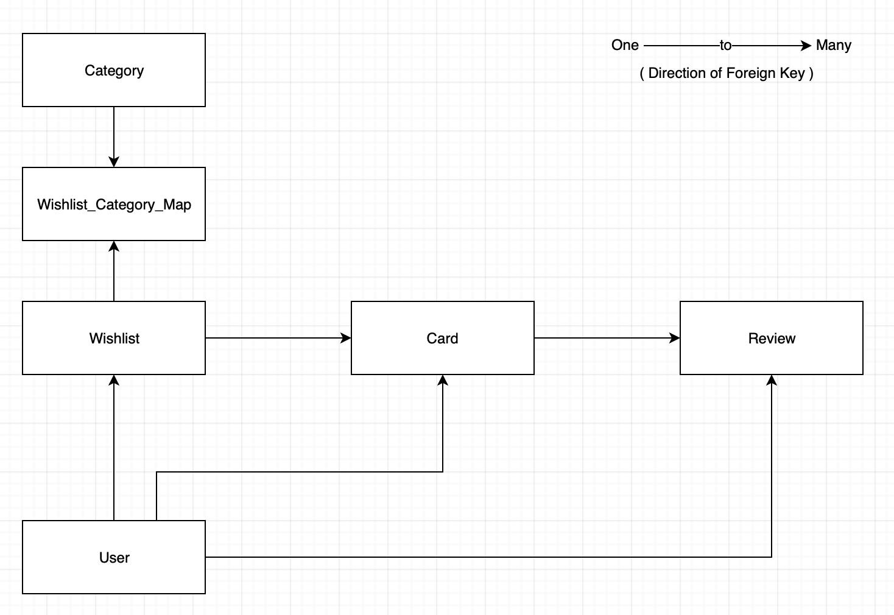

# Todify's Database Schema

## Diagram

## Tables

### User

   Column    |       Type        | Nullable |        Default        | Description 
-------------|-------------------|----------|-----------------------|-------------
 id          | `uuid`            | not null | new generated UUID    | UUID for the `UserObject`
 first_name  | `string`          | not null | ""                    | First name of the User 
 last_name   | `string`          | not null | ""                    | Last name of the User 
 email       | `string`          | not null |                       | Email address of the User 
 username    | `string`          | not null |                       | Username of the User 
 password    | `string`          | not null |                       | Password of the User 
 created_at  | `datetime`        | not null |                       | Time at which the `UserObject` created 
 modified_at | `datetime`        | not null |                       | Time at which the `UserObject` modified 
 avatar      | `string`          |          | null                  | URL of the image uploaded by the User 

__Referenced by__:
- TABLE "wishlist" CONSTRAINT "fk_user" FOREIGN KEY (created_by) REFERENCES user(id) ON DELETE CASCADE
- TABLE "category" CONSTRAINT "fk_user" FOREIGN KEY (created_by) REFERENCES user(id) ON DELETE CASCADE
- TABLE "card" CONSTRAINT "fk_user" FOREIGN KEY (created_by) REFERENCES user(id) ON DELETE CASCADE
- TABLE "review" CONSTRAINT "fk_user" FOREIGN KEY (created_by) REFERENCES user(id) ON DELETE CASCADE

----------------------------------------------------------------------------------------------------------------------------------------

### Wishlist

   Column    |       Type        | Nullable |      Default       | Description 
-------------|-------------------|----------|--------------------|-------------
 id          | `uuid`            | not null | new generated UUID | UUID for the `WishlistObject` 
 title       | `string`          | not null |                    | Title of the Wishlsit 
 is_public   | `boolean`         | not null | "false"            | Visibility of the wishlist
 created_at  | `datetime`        | not null |                    | Time at which the `WishlistObject` created 
 modified_at | `datetime`        | not null |                    | Time at which the `WishlistObject` modified 
 created_by  | `uuid`            | not null |                    | UUID for the `UserObject` 

__Foreign-key constraints__:
- "fk_user" FOREIGN KEY (created_by) REFERENCES user(id) ON DELETE CASCADE

__Referenced by__:
- TABLE "card" CONSTRAINT "fk_wishlist_table" FOREIGN KEY (created_in_wishlist) REFERENCES wishlist(id) ON DELETE CASCADE
- TABLE "wishlist_category_map" CONSTRAINT "fk_wishlist_table" FOREIGN KEY (wishlist) REFERENCES wishlist(id) ON DELETE CASCADE

----------------------------------------------------------------------------------------------------------------------------------------

### Category

 Column     |       Type        | Nullable |      Default       | Description 
------------|-------------------|----------|--------------------|-------------
 id         | `uuid`            | not null | new generated UUID | UUID for the `CategoryObject` 
 name       | `string`          | not null |                    | Name of the Category 
 created_by | `uuid`            | not null |                    | UUID for the `UserObject`

__Foreign-key constraints__:
- "fk_user" FOREIGN KEY (created_by) REFERENCES user(id) ON DELETE CASCADE

__Referenced by__:
- TABLE "wishlist_category_map" CONSTRAINT "fk_category_table" FOREIGN KEY (category) REFERENCES category(id) ON DELETE CASCADE

----------------------------------------------------------------------------------------------------------------------------------------

### Wishlist_Category_Map

  Column  | Type | Nullable |      Default       | Description 
----------|------|----------|--------------------|-------------
 id       | uuid | not null | new generated UUID | UUID for the `Wishlist_Category_MapObject` 
 wishlist | uuid | not null |                    | UUID for the `WishlistObject`
 category | uuid | not null |                    | UUID for the `CategoryObject` 

__Unique constraints__:
- "wishlist_category_map_wishlist_category_key" UNIQUE CONSTRAINT

__Foreign-key constraints__:
- "fk_category_table" FOREIGN KEY (category) REFERENCES category(id) ON DELETE CASCADE
- "fk_wishlist_table" FOREIGN KEY (wishlist) REFERENCES wishlist(id) ON DELETE CASCADE

----------------------------------------------------------------------------------------------------------------------------------------

### Card

  Column             |       Type        | Nullable |      Default       | Description 
---------------------|-------------------|----------|--------------------|-------------
 id                  | `uuid`            | not null | new generated UUID | UUID for the `CardObject` 
 title               | `string`          | not null |                    | Title of the Card 
 description         | `string`          |          | null               | Description of the Card 
 link                | `string`          |          | null               | Any hyper link 
 image               | `string`          |          | null               | URL of the image uploaded for the Card 
 created_at          | `datetime`        | not null |                    | Time at which the `CardObject` created 
 modified_at         | `datetime`        | not null |                    | Time at which the `CardObject` modified 
 created_by          | `uuid`            | not null |                    | UUID for the `UserObject` created this Card 
 wishlist            | `uuid`            | not null |                    | UUID for the `WishlistObject` under which this Card exists 

__Foreign-key constraints__:
- "fk_user" FOREIGN KEY (created_by) REFERENCES user(id) ON DELETE CASCADE
- "fk_wishlist_table" FOREIGN KEY (created_in_wishlist) REFERENCES wishlist(id) ON DELETE CASCADE

__Referenced by__:
- TABLE "review" CONSTRAINT "fk_card_table" FOREIGN KEY (created_for_card) REFERENCES card(id) ON DELETE CASCADE

----------------------------------------------------------------------------------------------------------------------------------------

### Review

  Column          |       Type        | Nullable |        Default        | Description 
------------------|-------------------|----------|-----------------------|-------------
 id               | `uuid`            | not null | new generated UUID    | UUID for the `ReviewObject` 
 comment          | `string`          | not null | ""                    | Review Comment 
 rating           | `integer`         |          | null                  | Rating between 0 and 10  
 will_recommend   | `boolean`         |          | null                  | Weather User would recommend the card or not
 created_at       | `datetime`        | not null |                       | Time at which the `ReviewObject` created 
 modified_at      | `datetime`        | not null |                       | Time at which the `ReviewObject` modified 
 created_by       | `uuid`            | not null |                       | UUID for the `UserObject` who created the Review 
 card             | `uuid`            | not null |                       | UUID for the `CardObject` for which this Review was created 

__Check constraints__:
- "max_rating" CHECK (rating <= 10)
- "min_rating" CHECK (rating >= 0)

__Foreign-key constraints__:
- "fk_card_table" FOREIGN KEY (created_for_card) REFERENCES card(id) ON DELETE CASCADE
- "fk_user" FOREIGN KEY (created_by) REFERENCES user(id) ON DELETE CASCADE

